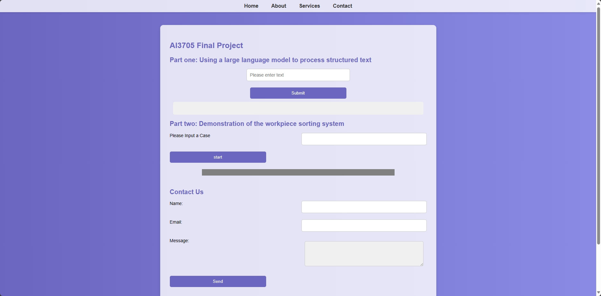

# AI3705-final-project

## Industrial control code generation application tool design and development

> [Runze Guo](https://github.com/Alanze) , [Shengxin Pei](https://github.com/P-S-X) , [Qiwen Zeng](https://github.com/rustylake1)

### Prerequisites
- Linux or macOS
- Python 3
- CPU or NVIDIA GPU + CUDA CuDNN

### Getting started

Install Flask and other dependenies.

For pip users, please type the command `pip install flask`

- run `generated_code.py` to check the result in terminal and the web

### Result

